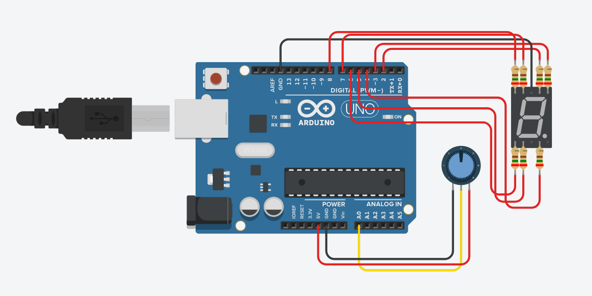

# 7 Filament Display

  

## Circuit
> [!IMPORTANT] This code are made for common cathode circuit

PIN A0 (Arduino Analog 0) read OUTPUT of a potentiometer in pull down mode

| PIN   | ARDUINO       |  
| :---------- | :--------- |  
| 1| GND |  
| 2| OUTPUT |  
| 3| VCC |   

## 7 Filament Display PINS common cathode

> [!IMPORTANT] Use min 250Ω resistor on all vcc

| PIN   | FILAMENT LETTER       |  
| :---------- | :--------- |  
| 2| A |  
| 3| B |  
| 4| C |  
| 5| D |  
| 6| E |  
| 7| F |  
| 8| G | 
